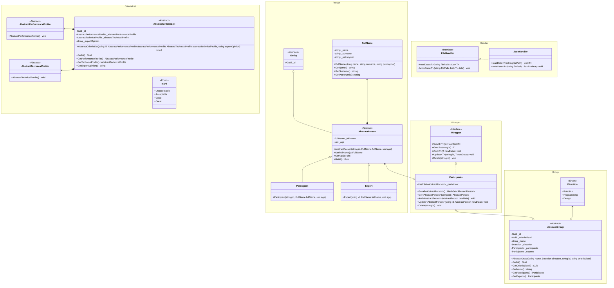

```mermaid
classDiagram
    namespace CriteriaList {
        class AbstractCriteriaList {
            <<Abstract>>
            -Guid _id
            -AbstractPerformanceProfile _abstractPerformanceProfile
            -AbstractTechnicalProfile _abstractTechnicalProfile
            -string _expertOpinion
            +AbstractCriteriaList(string id, AbstractPerformanceProfile abstractPerformanceProfile, AbstractTechnicalProfile abstractTechnicalProfile, string expertOpinion) void
            +GetId() Guid
            +GetPerformanceProfile() AbstractPerformanceProfile
            +GetTechnicalProfile() AbstractTechnicalProfile
            +GetExpertOpinion() string
        }

        class AbstractPerformanceProfile {
            <<Abstract>>
            +AbstractPerformanceProfile() void
        }

        class AbstractTechnicalProfile {
            <<Abstract>>
            +AbstractTechnicalProfile() void
        }

        class Mark {
            <<Enum>>
            +Unacceptable
            +Acceptable
            +Good
            +Great
        }
    }
    AbstractPerformanceProfile <--* AbstractCriteriaList
    AbstractTechnicalProfile <--* AbstractCriteriaList

    namespace Person {
        class FullName {
            -string _name
            -string _surname
            -string _patronymic
            +FullName(string name, string surname, string patronymic)
            +GetName() string
            +GetSurname() string
            +GetPatronymic() string
        }

        class IEntity {
            <<Interface>>
            #Guid _id
        }

        class AbstractPerson {
            <<Abstract>>
            -FullName _fullName
            -uint _age
            +AbstractPerson(string id, FullName fullName, uint age)
            +GetFullName() FullName
            +GetAge() uint
            +GetId() Guid
        }

        class Participant {
            +Participant(string id, FullName fullName, uint age)
        }

        class Expert {
            +Expert(string id, FullName fullName, uint age)
        }
    }
    FullName <--* AbstractPerson
    IEntity <|-- AbstractPerson
    AbstractPerson <|-- Participant
    AbstractPerson <|-- Expert

    namespace Wrapper {
        class IWrapper {
            <<Interface>>
            #GetAll~T~() HashSet~T~
            #Get~T~(string id) T
            #Add~T~(T newData) void
            #Update~T~(string id, T newData) void
            #Delete(string id) void
        }

        class Participants {
            -HashSet~AbstractPerson~ _participant
            +GetAll~AbstractPerson~() HashSet~AbstractPerson~
            +Get~AbstractPerson~(string id) AbstractPerson
            +Add~AbstractPerson~(AbstractPerson newData) void
            +Update~AbstractPerson~(string id, AbstractPerson newData) void
            +Delete(string id) void
        }
    }
    IWrapper <|.. Participants
    AbstractPerson <--o Participants

    namespace Group {
        class Direction {
            <<Enum>>
            +Robotics
            +Programming
            +Design
        }

        class AbstractGroup {
            <<Abstract>>
            -Guid _id
            -Guid _criteriaListId
            -string _name
            -Direction _direction
            -Participants _participants
            -Participants _experts
            +AbstractGroup(string name, Direction direction, string id, string criteriaListId)
            +GetId() Guid
            +GetCriteriaListId() Guid
            +GetName() string
            +GetParticipants() Participants
            +GetExperts() Participants
        }
    }
    Direction <--o AbstractGroup
    Participants <--o AbstractGroup

    namespace Handler {
        class FileHandler {
            <<Interface>>
            #readData~T~(string filePath) List~T~
            #writeData~T~(string filePath, List~T~ data) void
        }

        class JsonHandler {
            +readData~T~(string filePath) List~T~
            +writeData~T~(string filePath, List~T~ data) void
        }
    }
    FileHandler <|.. JsonHandler
```
