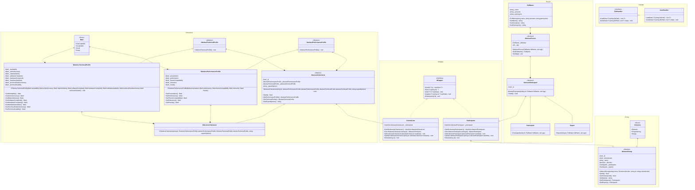

```mermaid
classDiagram
    namespace CriteriaList {
        class AbstractCriteriaList {
            <<Abstract>>
            -Guid _id
            -AbstractPerformanceProfile _abstractPerformanceProfile
            -AbstractTechnicalProfile _abstractTechnicalProfile
            -string _expertOpinion
            +AbstractCriteriaList(string id, AbstractPerformanceProfile abstractPerformanceProfile, AbstractTechnicalProfile abstractTechnicalProfile, string expertOpinion) void
            +GetId() Guid
            +GetPerformanceProfile() AbstractPerformanceProfile
            +GetTechnicalProfile() AbstractTechnicalProfile
            +GetExpertOpinion() string
        }

        class AbstractPerformanceProfile {
            <<Abstract>>
            +AbstractPerformanceProfile() void
        }

        class AbstractTechnicalProfile {
            <<Abstract>>
            +AbstractTechnicalProfile() void
        }

        class Mark {
            <<Enum>>
            +Unacceptable
            +Acceptable
            +Good
            +Great
        }

        class RoboticsCriteriaList {
            +RoboticsCriteriaList(string id, RoboticsPerformanceProfile roboticsPerformanceProfile, RoboticsTechnicalProfile roboticsTechnicalProfile, string expertOpinion)
        }

        class RoboticsPerformanceProfile {
            -Mark _presentation
            -Mark _performance
            -Mark _themeCompatibility
            -Mark _relevance
            -Mark _novelty
            +RoboticsPerformanceProfile(Mark presentation, Mark preformance, Mark themeCompatibility, Mark relevance, Mark novelty)
            +GetPresentation() Mark
            +GetPerformance() Mark
            +GetThemeCompatibility() Mark
            +GetRelevance() Mark
            +GetNovelty() Mark
        }

        class RoboticsTechnicalProfile {
            -Mark _workability
            -Mark _actionAccuracy
            -Mark _materialVariety
            -Mark _softwareComplexity
            -Mark _hardwareComplexity
            -Mark _hardwareAesthetic
            -Mark _technicalSolutionLiteracy
            -Mark _technicalUsability
            +RoboticsTechnicalProfile(Mark workability, Mark actionAccuracy, Mark materialVariety, Mark softwareComplexity, Mark hardwareComplexity, Mark hardwareAesthetic, Mark technicalSoultionLiteracy, Mark technicalSolution) void
            +GetWorkability() Mark
            +GetActionAccuracy() Mark
            +GetMaterialVariety() Mark
            +GetSoftwareComplexity() Mark
            +GetHardwareComplexity() Mark
            +GetHardwareAesthetic() Mark
            +GetTechnicalSolutionLiteracy() Mark
            +GetTechnicalUsability() Mark
        }

    }
    AbstractPerformanceProfile <--* AbstractCriteriaList
    AbstractTechnicalProfile <--* AbstractCriteriaList
    AbstractCriteriaList <|-- RoboticsCriteriaList
    AbstractPerformanceProfile <|-- RoboticsPerformanceProfile
    AbstractTechnicalProfile <|-- RoboticsTechnicalProfile
    Mark <--* RoboticsPerformanceProfile
    Mark <--* RoboticsTechnicalProfile
    RoboticsPerformanceProfile <--* RoboticsCriteriaList
    RoboticsTechnicalProfile <--* RoboticsCriteriaList

    namespace Wrapper {
        class IWrapper {
            <<Interface>>
            #GetAll~T~() HashSet~T~
            #Get~T~(string id) T
            #Add~T~(T newData) void
            #Update~T~(string id, T newData) void
            #Delete(string id) void
        }

        class CriteriaLists {
            -HashSet~AbstractCriteriaList~ _criteriaLists
            +GetAll~AbstractCriteriaList~() HashSet~AbstractCriteriaList~
            +Get~AbstractCriteriaList~(string id) AbstractCriteriaList
            +Add~AbstractCriteriaList~(AbstractCriteriaList newData) void
            +Update~AbstractCriteriaList~(string id, AbstractCriteriaList newData) void
            +Delete(string id) void
        }

        class Participants {
            -HashSet~AbstractParticipant~ _participant
            +GetAll~AbstractParticipant~() HashSet~AbstractParticipant~
            +Get~AbstractParticipant~(string id) AbstractParticipant
            +Add~AbstractParticipant~(AbstractParticipant newData) void
            +Update~AbstractParticipant~(string id, AbstractParticipant newData) void
            +Delete(string id) void
        }
    }
    IWrapper <|.. CriteriaLists
    IWrapper <|.. Participants
    AbstractCriteriaList <--o CriteriaLists
    AbstractParticipant <--o Participants

    namespace Person {
        class FullName {
            -string _name
            -string _surname
            -string _patronymic
            +FullName(string name, string surname, string patronymic)
            +GetName() string
            +GetSurname() string
            +GetPatronymic() string
        }

        class AbstractPerson {
            <<Abstract>>
            -FullName _fullName
            -uint _age
            +AbstractPerson(FullName fullName, uint age)
            +GetFullName() FullName
            +GetAge() uint
        }

        class AbstractParticipant {
            <<Abstract>>
            -Guid _id
            AbstractParticipant(string id, FullName fullName, uint age)
            +GetId() Guid
        }

        class Participant {
            +Participant(string id, FullName fullName, uint age)
        }

        class Expert {
            +Expert(string id, FullName fullName, uint age)
        }
    }
    FullName <--* AbstractPerson
    AbstractPerson <--* AbstractParticipant
    AbstractParticipant <|-- Participant
    AbstractParticipant <|-- Expert

    namespace Group {
        class Direction {
            <<Enum>>
            +Robotics
            +Programming
            +Design
        }

        class AbstractGroup {
            <<Abstract>>
            -Guid _id
            -Guid _criteriaListId
            -string _name
            -Direction _direction
            -Participants _participants
            -Participants _experts
            +AbstractGroup(string name, Direction direction, string id, string criteriaListId)
            +GetId() Guid
            +GetCriteriaListId() Guid
            +GetName() string
            +GetParticipants() Participants
            +GetExperts() Participants
        }
    }
    Direction <--o AbstractGroup
    Participants <--o AbstractGroup

    namespace Handler {
        class FileHandler {
            <<Interface>>
            #readData~T~(string filePath) List~T~
            #writeData~T~(string filePath, List~T~ data) void
        }

        class JsonHandler {
            +readData~T~(string filePath) List~T~
            +writeData~T~(string filePath, List~T~ data) void
        }
    }
    FileHandler <|.. JsonHandler
```
